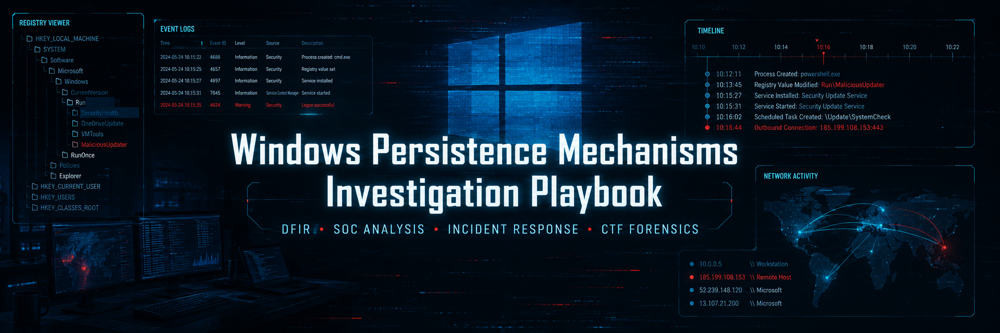

<h1 align="center">Windows Persistence Mechanisms Investigation Playbook</h1>

  

## 🎯 Overview

This playbook provides a structured approach to **identifying and analyzing persistence mechanisms on Windows systems** during DFIR investigations and CTF scenarios.

Persistence is a critical stage in the attack lifecycle, allowing adversaries to maintain access across reboots, logouts, and system changes.

## 🧠 Persistence Coverage

1. [Registry-based persistence](01-registry-based-persistence.md)
2. [Scheduled tasks abuse](02-scheduled-tasks-abuse.md)
3. [Windows services & drivers](03-windows-services-and-drivers.md)
4. [Startup folder execution](04-sartup-folder-execution.md)
5. [WMI event subscriptions](05-wmi-event-subscriptions.md)
6. [Logon scripts & Group Policy abuse](06-logon-scripts-and-group-policy-abuse.md)
7. [COM hijacking & DLL redirection](07-com-hijacking-and-dll-redirection.md)
8. [Correlation & incident reconstruction](08-correlation-and-incident-reconstruction.md)
